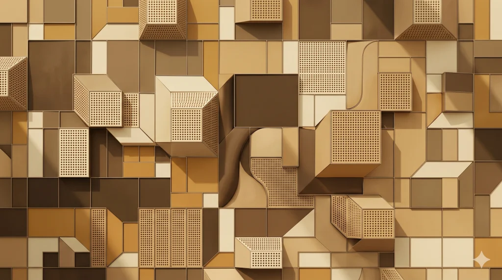

# Studio Bombay Twenty Six

A personal blog WordPress block theme — calm, quirky, joyful.

Built by [Aditya Kane](https://bombaypirate.com) for his own blog. Live at **[bombaypirate.com](https://bombaypirate.com)**.



---

## About

**Studio Bombay Twenty Six** is a Full Site Editing (FSE) WordPress block theme designed for personal blogs and independent publications. It combines editorial typographic sensibility with a handcrafted, print-inspired aesthetic, ink borders, sepia tones, saffron or orange accents, and a walking elephant that tracks your scroll progress.

The theme is opinionated, specific, and personal. It is not a general-purpose starter theme.

> *Studio Bombay Twenty Six — calm, quirky, joyful.*

---

## Features

- ⚡ **Full Site Editing (FSE)** — block-based templates and template parts
- 🎨 **Print-inspired design** — ink borders, cream backgrounds, saffron and sage accents
- 🐘 **Scroll Elephant** — a custom animated elephant that walks across the screen as you scroll
- 🖼️ **Photo archive support** — dedicated photos template and 3-column photo grid pattern
- 📖 **Reading-first layout** — clean, distraction-free single post view
- ✒️ **Letterpress & grain effects** — subtle CSS texture utilities
- 🔡 **Typographic hierarchy** — Space Mono for labels, serif for body
- 📱 **Responsive** — elephant hidden on very small screens, fluid layouts throughout
- 🪶 **Lightweight** — no jQuery, no framework dependencies
- 🌐 **GPL v2 licensed** — free and open source

---

## Theme Structure

```
studio-bombay-twenty-six/
│
├── assets/
│   └── images/
│       ├── bombaypirate-twentysix-1024x572.webp   # Theme preview
│       └── paper-background-title.webp             # Hero background texture
│
├── parts/                        # Template parts
│   ├── header.html
│   ├── footer.html
│   └── navigation-overlay.html
│
├── patterns/                     # Block patterns
│   ├── home.php
│   ├── index.php
│   ├── single.php
│   ├── hero-section.php
│   ├── footer.php
│   ├── latest-blogs.php
│   ├── 3-column-photos.php
│   ├── photos-archive.php
│   ├── two-column-sticky-post.php
│   ├── search.php
│   └── 404.php
│
├── templates/                    # Page templates
│   ├── index.html
│   ├── home.html
│   ├── single.html
│   ├── page.html
│   ├── archive.html
│   ├── photos-archive.html
│   ├── search.html
│   └── 404.html
│
├── content-loader.php            # Dynamic content loading
├── fonts.php                     # Font enqueues
├── functions.php                 # Theme setup
├── styles.php                    # Additional styles
├── theme-assets-rewrite.php      # Asset URL rewriting
├── scroll-elephant.js            # Scroll progress elephant animation
├── theme-assets-editor-rewrite.js
├── style.css                     # Theme header + base styles
├── theme.json                    # Global settings and styles
├── screenshot.webp               # Theme screenshot
├── readme.txt                    # WordPress.org readme
└── README.md                     # This file
```

---

## Requirements

| Requirement | Version |
|---|---|
| WordPress | 6.9 or higher |
| PHP | 7.4 or higher |

---

## Installation

### From GitHub Releases

1. Download the latest release zip from the [Releases](../../releases) page
2. In your WordPress dashboard, go to **Appearance → Themes → Add New → Upload Theme**
3. Upload the zip and activate

### For Development

```bash
# Clone the repository
git clone https://github.com/bombaypirate/studio-bombay-twenty-six.git

# Copy or symlink into your local WordPress install
cp -r studio-bombay-twenty-six /path/to/wordpress/wp-content/themes/
```

---

## Design System

The theme uses a small, intentional color palette defined in `theme.json`:

| Token | Role |
|---|---|
| `--wp--preset--color--ink` | Primary dark — borders, text, dividers |
| `--wp--preset--color--cream` | Background — cards, page bg |
| `--wp--preset--color--saffron` | Accent — underlines, elephant trail, highlights |
| `--wp--preset--color--sage` | Secondary accent — tags, nav hover |

Custom CSS utilities in `style.css` include `.broadsheet-frame`, `.post-card`, `.ornament-rule`, `.star-divider`, `.elephant-track`, `.letterpress`, `.saffron-underline`, and `.grain-overlay`.

---

## The Scroll Elephant

`scroll-elephant.js` renders a small SVG elephant that walks across the bottom of the viewport as you scroll down the page, leaving a dotted saffron trail behind it. It disappears on screens narrower than 480px.

---

## Development Notes

This theme was prototyped using [Create Block Theme](https://wordpress.org/plugins/create-block-theme/) and [Telex by Automattic](https://telex.automattic.ai/). Changes to templates and patterns are best made via the WordPress Site Editor and exported using Create Block Theme.

---

## Changelog

### 1.0.0
- Initial release

---

## Credits

- Built by **Aditya Kane** — [bombaypirate.com](https://bombaypirate.com) · [@bombaypirate](https://github.com/bombaypirate)
- Tools **[Telex by Automattic](https://telex.automattic.ai/)** | **[Create Block Theme](https://wordpress.org/plugins/create-block-theme/)**
- Powered by **[WordPress](https://wordpress.org)**

---

## License

**Studio Bombay Twenty Six** is licensed under the [GNU General Public License v2 or later](https://www.gnu.org/licenses/gpl-2.0.html).

```
Studio Bombay Twenty Six WordPress Theme
Copyright (C) 2026 Aditya Kane, Telex by Automattic

This program is free software: you can redistribute it and/or modify
it under the terms of the GNU General Public License as published by
the Free Software Foundation, either version 2 of the License, or
(at your option) any later version.
```

---

* Bombay. WordPress. Elephants *
